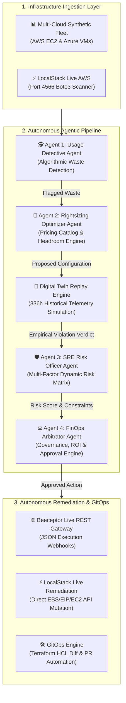

# ⚡ CloudSage FinOps AI
### Autonomous Multi-Agent FinOps & Infrastructure Optimization Engine

[](https://www.python.org/)
[](https://streamlit.io/)
[](https://aws.amazon.com/)
[](https://www.finops.org/)
[](https://localstack.cloud/)
[](smoke_test.py)

---

## 📌 Executive Summary

**CloudSage FinOps AI** is an enterprise-grade, autonomous multi-agent cloud financial operations (FinOps) platform. It continuously detects cloud infrastructure waste across multi-cloud environments (AWS & Azure), models rightsizing recommendations against live multi-cloud pricing catalogs, and stress-tests proposed changes using a **Digital Twin Telemetry Replay Engine** over 336+ hours of historical demand.

Every optimization is validated against an **SRE Risk & Governance Engine** with fully tunable enterprise policy thresholds before being autonomously executed via **Beeceptor REST Webhooks**, live **LocalStack AWS Boto3 Remediation**, or exportable **GitOps Terraform Pull Requests**.

---

## 🏗️ System Architecture & 4-Agent Pipeline



### The 4 Autonomous Agents Explained

| Agent | Module | Role & Core Logic |
| :--- | :--- | :--- |
| **Agent 1: Usage Detective** | [`logic_agents.py`](file:///./logic_agents.py) | **Algorithmic Waste Detection**: Analyzes fleet utilization without LLM hallucinations. Identifies overprovisioned CPUs/RAM, idle zombie instances, unattached disks, unassociated Elastic IPs, abandoned GPU nodes, and unscheduled non-production workloads running 24/7. |
| **Agent 2: Rightsizing Optimizer** | [`logic_agents.py`](file:///./logic_agents.py) | **Multi-Cloud Catalog Optimization**: Evaluates candidates against frozen AWS and Azure pricing catalogs. Computes safe downsized instance tiers with safety headroom buffers and calculates exact monthly & annual ROI. |
| **Digital Twin Engine** | [`digital_twin.py`](file:///./digital_twin.py), [`twin_agent_bridge.py`](file:///./twin_agent_bridge.py) | **Empirical Historical Replay**: Backtests proposed tier configurations against 336 hours (14 days) of fine-grained telemetry data. Flags tail-risk spikes that a static formula would miss. Feeds an empirical penalty directly into Agent 3. |
| **Agent 3: SRE Risk Officer** | [`ai_agents.py`](file:///./ai_agents.py), [`risk_config_store.py`](file:///./risk_config_store.py) | **Configurable Multi-Factor Risk Assessment**: Evaluates environment tier (prod vs non-prod), workload statefulness, dependency critical path, safety headroom, and digital twin violations. Produces a 0–100 risk score and verdict (`APPROVED`, `APPROVED_WITH_CONDITIONS`, `REJECTED`). |
| **Agent 4: FinOps Arbitrator** | [`ai_agents.py`](file:///./ai_agents.py) | **Autonomous Conflict Resolution**: Weighs cost savings against operational risk. Dispatches approved remediations, generates executive justifications (via optional Gemini LLM or deterministic fallback), and formats GitOps pull requests. |

---

## 🚀 Key Features

### 1. Three Production-Grade Infrastructure Modes
- **Mode 1: Multi-Cloud Synthetic Fleet**:
  - Simulates 18+ heterogeneous enterprise workloads (production web clusters, batch processors, GPU AI training nodes, staging/dev environments).
  - One-click autonomous execution dispatched to Beeceptor REST endpoints with full payload logging.
- **Mode 2: LocalStack Live AWS Emulation (Port 4566)**:
  - Real Boto3 client integration against a local AWS emulator.
  - Actively scans for and deletes orphaned EBS volumes, releases unattached Elastic IPs, and resizes EC2 instances without AWS cloud spend.
- **Mode 3: Enterprise GitOps Pull Requests**:
  - Automatically generates ready-to-merge Terraform HCL diffs (`production_infrastructure.tf`).
  - Includes automated SRE compliance stamps, baseline vs. target cost deltas, and headroom verification.

### 2. Configurable SRE Risk Policy Store (`risk_config_store.py`)
- Fine-grained enterprise governance:
  - Factor weight sliders (Environment, Criticality, Capacity, Volatility, Dependency).
  - Tunable production and non-production base risk penalty scores.
  - Adjustable verdict thresholds (`Low Risk Max`, `Medium Risk Max`).
- Live JSON persistence (`risk_config.json`) with runtime validation (guarantees weight conservation $\sum w_i = 1.0$).

### 3. High-Fidelity Executive Dashboard (`app.py`)
- Obsidian/slate dark mode designed for high-density FinOps analysts.
- Interactive Plotly visualizations: spend distribution by provider, savings waterfall, risk-vs-ROI scatter plots, and utilization gauges.
- Operator approval controls: manual override for operator rejections or conditioned approvals.

---

## 📁 Repository Structure

```text
finops-ai-DSU/
├── app.py                      # Core Streamlit web application & executive dashboard
├── logic_agents.py             # Agent 1 (Usage Detective) & Agent 2 (Rightsizing Optimizer)
├── ai_agents.py                # Agent 3 (SRE Risk Officer) & Agent 4 (FinOps Arbitrator)
├── risk_config_store.py        # Enterprise SRE policy store, JSON loader & validator
├── risk_config.json            # Persistent governance risk weights and thresholds
├── digital_twin.py             # Historical telemetry simulation & replay engine
├── twin_agent_bridge.py        # Bridge feeding digital twin verdicts into Agent 3
├── fleet_data.py               # Enterprise multi-cloud fleet definition (AWS & Azure)
├── generate_fleet_history.py   # Telemetry timeseries generator (336h synthetic workload data)
├── localstack_service.py       # Live AWS Boto3 scanner and remediation service
├── seed_localstack.py          # Script to populate LocalStack with simulated waste resources
├── terraform_generator.py      # GitOps Terraform HCL diff & PR description engine
├── beeceptor_gateway.py        # REST client dispatching execution events to Beeceptor
├── smoke_test.py               # Comprehensive deterministic test suite
├── check_imports.py            # Environment import diagnostics
├── render.yaml                 # Deployment specification for Render.com
├── requirements.txt            # Project dependencies
└── data/                       # Telemetry data repository
    ├── fleet_metadata.json     # Workload metadata catalog
    └── history/                # 36 individual 336-hour CSV telemetry profiles
```

---

## ⚙️ Quickstart & Installation

### Prerequisites
- Python 3.10 or 3.11 installed
- `pip` package manager

### 1. Clone or Extract the Project
Open a terminal in the project root directory:
```bash
cd finops-ai-DSU
```

### 2. Create and Activate a Virtual Environment
```bash
# Windows (PowerShell)
python -m venv venv
.\venv\Scripts\Activate.ps1

# Linux / macOS
python3 -m venv venv
source venv/bin/activate
```

### 3. Install Dependencies
```bash
pip install -r requirements.txt
```

### 4. Run the Verification Suite
Execute the automated smoke tests to verify all 4 agents, the digital twin, and risk validation:
```bash
python smoke_test.py
```
*Expected output: `ALL ASSERTIONS PASSED [OK]` with 0 errors.*

### 5. Launch the Dashboard
```bash
streamlit run app.py
```
Open your browser at **`http://localhost:8501`**.

---

## 🛠️ Infrastructure Modes Walkthrough

### Mode 1: Multi-Cloud Fleet & Beeceptor Execution
1. Select **📊 Multi-Cloud Synthetic Fleet** in the sidebar.
2. Filter by provider (`AWS`, `AZURE`, or `All`).
3. View the fleet audit table, risk badges, and ROI calculations.
4. Click **🚀 Execute Autonomous Remediation** on any approved server to send a webhook event to Beeceptor.

### Mode 2: LocalStack Live AWS Emulation (Port 4566)
1. *(Optional)* Start LocalStack locally (e.g. via Docker or binary):
   ```bash
   docker run --rm -it -p 4566:4566 -p 4510-4559:4510-4559 localstack/localstack
   ```
2. Seed the local environment with sample waste:
   ```bash
   python seed_localstack.py
   ```
3. Select **⚡ LocalStack Live AWS (Port 4566)** in the dashboard sidebar.
4. Scan and remediate live resources directly from the UI.

### Mode 3: Enterprise GitOps Pull Requests
1. Select **🛠️ Enterprise GitOps PRs** in the sidebar.
2. Select any server recommendation to view the auto-generated Terraform HCL diff.
3. Review the SRE risk verification stamp and simulate PR merge.

---

## 📊 FinOps Foundation Alignment

This project adheres directly to the **FinOps Open Cost Management Framework**:
1. **Inform**: Real-time visibility into multi-cloud spend across AWS and Azure, normalized into standardized hourly and monthly rates.
2. **Optimize**: Automated rightsizing, zombie infrastructure retirement, and non-prod schedule automation with deterministic math.
3. **Operate**: Closed-loop governance combining SRE risk checks, Digital Twin backtesting, and automated GitOps / REST execution.

---

## 👨‍💻 Submission Notes

- **Deterministic Core**: All cost, rightsizing, safety headroom, and risk math are computed purely in Python with zero external API dependencies required for grading.
- **LLM Enhancement**: An optional Google Gemini API key can be supplied in the sidebar for natural language executive briefings, but is **not** required for full operational functionality.
- **Verified Clean**: Contains zero cached artifacts or hardcoded credentials. Ready for immediate evaluation.
